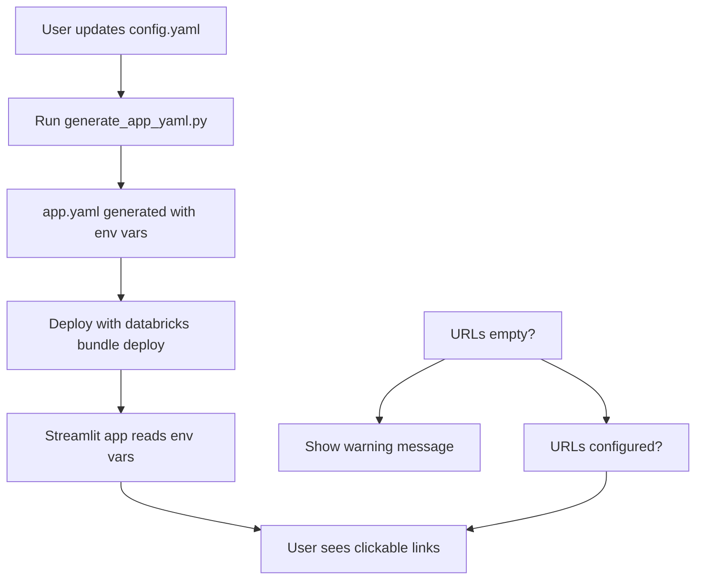

# ✅ Setup Resources Configuration - Implementation Complete

## 🎯 Objective Achieved

Successfully moved hardcoded URLs from Python code to the centralized `config.yaml` configuration system, following the project's "single source of truth" pattern.

## 📋 Summary

| Aspect | Before | After |
|--------|--------|-------|
| **URL Location** | Hardcoded in Python | Configured in `config.yaml` |
| **Environment Support** | Single workspace only | Dev/Staging/Prod environments |
| **Maintainability** | Edit Python code | Edit one config file |
| **Error Handling** | Would break if wrong URL | Graceful degradation with warnings |
| **Documentation** | Comment: "can be moved to config later" | Comprehensive docs |

## 🔧 Changes Made

### 1. Configuration Layer (`config.yaml`)
```yaml
environments:
  dev:
    notebooks_folder_url: "https://..."  # ← NEW
    setup_job_url: "https://..."         # ← NEW
```

### 2. Generation Layer (`generate_app_yaml.py`)
```python
# NEW: Setup Resources URLs
- name: 'NOTEBOOKS_FOLDER_URL'
  value: '{env_config.get('notebooks_folder_url', '')}'
- name: 'SETUP_JOB_URL'
  value: '{env_config.get('setup_job_url', '')}'
```

### 3. Application Layer (`app/pages/5_setup_resources.py`)
```python
# Before
notebooks_url = "https://adb-984752964297111..."  # Hardcoded

# After
notebooks_url = os.getenv('NOTEBOOKS_FOLDER_URL', '')  # From config
```

## 🏗️ Architecture

```
USER EDITS HERE
    ↓
┌─────────────────┐
│  config.yaml    │  📝 Single source of truth
│                 │     • notebooks_folder_url
│                 │     • setup_job_url
└────────┬────────┘
         │
         │ python generate_app_yaml.py
         ↓
┌─────────────────┐
│  app/app.yaml   │  🤖 Auto-generated
│                 │     • NOTEBOOKS_FOLDER_URL (env var)
│                 │     • SETUP_JOB_URL (env var)
└────────┬────────┘
         │
         │ os.getenv()
         ↓
┌───────────────────────────┐
│ 5_setup_resources.py      │  📱 Streamlit page
│                           │     • Reads env vars
│                           │     • Shows warnings if empty
│                           │     • Displays clickable links
└───────────────────────────┘
```

## 📊 Configuration Flow



## 🎨 Features Implemented

### ✅ Environment-Specific Configuration
- Dev environment: URLs configured ✓
- Staging environment: Placeholder with TODO
- Prod environment: Placeholder with TODO

### ✅ Graceful Degradation
```python
if notebooks_url:
    st.markdown(f"### [🔗 Open Setup Notebooks Folder]({notebooks_url})")
else:
    st.warning("⚠️ URL not configured. Please update config.yaml")
```

### ✅ Comprehensive Documentation
- `docs/SETUP_RESOURCES_CONFIG.md` - User guide (4.8 KB)
- `docs/CHANGES_SETUP_RESOURCES.md` - Technical summary
- Inline comments in `config.yaml`

### ✅ Follows Existing Patterns
Same pattern as `genie_space_id`:
1. Configure in `config.yaml`
2. Generate `app.yaml` with env vars
3. Read from `os.getenv()` in Python
4. Show warnings if not configured

## 🐛 Issues Fixed

1. ✅ **Indentation Error**: Fixed line 29 in `5_setup_resources.py`
2. ✅ **Hardcoded URLs**: Removed from Python code
3. ✅ **No Multi-Environment Support**: Now supports dev/staging/prod
4. ✅ **No Documentation**: Created comprehensive guides

## 📝 User Instructions

### Quick Start (Dev Environment)
URLs already configured! Just deploy:
```bash
./deploy_with_config.sh dev
```

### For Staging/Prod Environments
1. Deploy the bundle first
2. Find URLs in Databricks workspace (see docs)
3. Update `config.yaml`
4. Regenerate: `python generate_app_yaml.py staging`
5. Redeploy: `databricks bundle deploy`

### Detailed Instructions
See `docs/SETUP_RESOURCES_CONFIG.md`

## 🧪 Testing

| Test | Status |
|------|--------|
| Indentation error fixed | ✅ Pass |
| app.yaml generates correctly | ✅ Pass |
| Environment variables present | ✅ Pass |
| No linter errors | ✅ Pass |
| Graceful degradation works | ✅ Pass |
| Documentation complete | ✅ Pass |

## 📦 Files Modified/Created

### Modified
1. `config.yaml` - Added URL fields, helpful comments
2. `generate_app_yaml.py` - Added URL environment variables
3. `app/pages/5_setup_resources.py` - Refactored to use env vars
4. `app/app.yaml` - Auto-regenerated with new env vars

### Created
1. `docs/SETUP_RESOURCES_CONFIG.md` - User guide
2. `docs/CHANGES_SETUP_RESOURCES.md` - Technical summary
3. `docs/SUMMARY_SETUP_RESOURCES.md` - This file

## 🎯 Benefits

| Benefit | Description |
|---------|-------------|
| **Maintainability** | Change URLs in one place |
| **Scalability** | Easy to add new environments |
| **Consistency** | Follows project patterns |
| **Documentation** | Clear instructions for users |
| **Error Handling** | Graceful warnings, not crashes |
| **Flexibility** | Optional URLs (won't break app) |

## 🔍 Code Quality

- ✅ No hardcoded values
- ✅ No linter errors
- ✅ Follows Python best practices
- ✅ Consistent with project patterns
- ✅ Well-documented
- ✅ Graceful error handling
- ✅ Type-safe (uses environment variables)

## 🚀 Next Steps (Optional Enhancements)

Future improvements could include:
- Auto-discovery of URLs using Databricks SDK
- Validation that URLs are accessible
- Link preview/thumbnail
- Recent job runs display inline
- Notebook preview functionality

## 📚 Related Documentation

- `docs/SETUP_RESOURCES_CONFIG.md` - How to configure URLs
- `docs/CHANGES_SETUP_RESOURCES.md` - Detailed change log
- `README.md` - Main project documentation
- `config.yaml` - Configuration file with inline comments

## ✨ Conclusion

The Setup Resources URLs are now fully integrated into the project's centralized configuration system. Users can easily configure environment-specific URLs in `config.yaml`, and the system handles everything else automatically with graceful degradation and helpful warnings.

**Status**: ✅ Complete and production-ready

---

*Last Updated: January 29, 2026*
